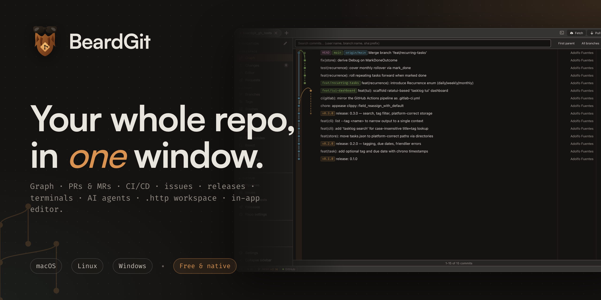
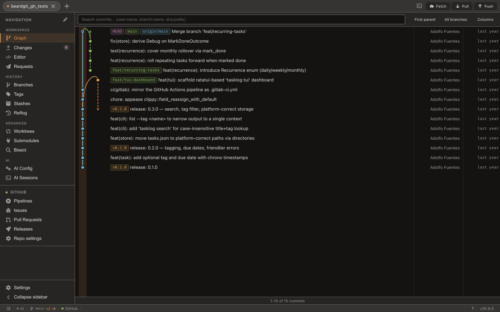
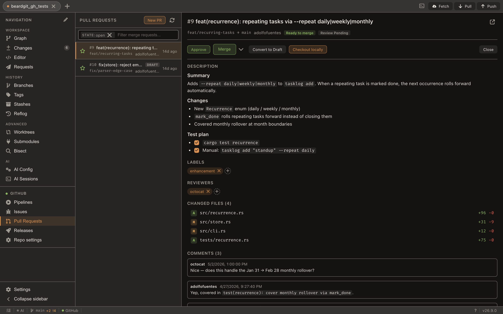
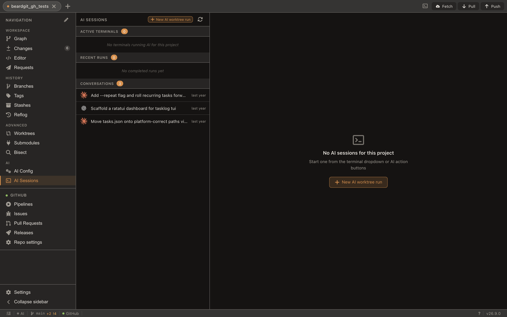
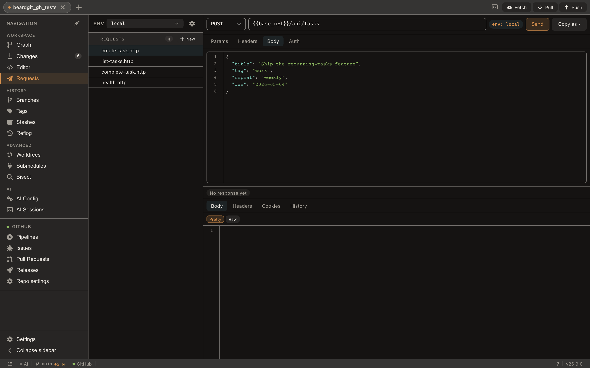
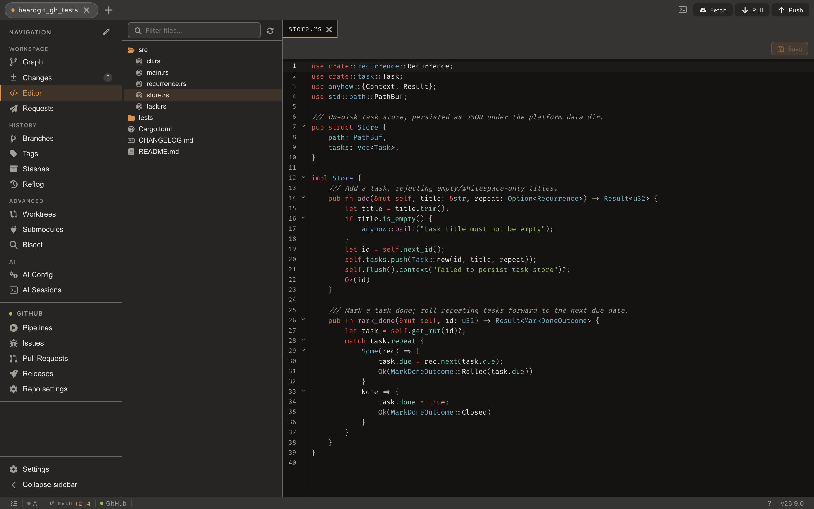

<p align="right">
  <a href="README.md">English</a> · <strong>Español</strong>
</p>

<p align="center">
  
</p>

<h1 align="center">BeardGit</h1>

<p align="center">
  <strong>Todo tu repo, en una sola ventana.</strong>
  <br />
  Deja de saltar entre seis pestañas para subir un commit. Grafo, PRs y MRs, issues, pipelines de CI/CD, releases, terminales, agentes de IA, un workspace <code>.http</code> versionado en el repo y un editor de código integrado — todo en una app de escritorio nativa.
  <br />
  Sin Electron. Sin telemetría. macOS · Linux · Windows.
</p>

<p align="center">
  <a href="https://github.com/The3eard/BeardGit/releases/latest"></a>
  <a href="LICENSE.md"></a>
  <a href="https://github.com/The3eard/BeardGit/actions"></a>
  
  
</p>

<p align="center">
  <a href="https://github.com/The3eard/BeardGit/releases/latest"><strong>Descargar para macOS, Linux o Windows ↓</strong></a>
  &nbsp;·&nbsp;
  <a href="https://the3eard.github.io/BeardGit/">Visitar la web</a>
  &nbsp;·&nbsp;
  <a href="#para-quién-es-beardgit">¿Es para mí?</a>
</p>

<p align="center">
  <em>Si BeardGit te ahorra una pestaña, deja una ⭐ — es como nos descubre la gente.</em>
</p>

---

## § 01 — Manifiesto

El código se envía desde **un solo teclado**, no desde diecisiete pestañas. BeardGit parte de una premisa simple: _todo lo que tocas para liberar un cambio debería vivir en una sola app._ Tu grafo de commits. Tus ramas. Tu staging. Tus pull requests y merge requests en **GitHub y GitLab**. Tus pipelines de CI y trabajos de despliegue. Tus issues, etiquetas y releases. Tus terminales. Tus agentes de IA. Tus **peticiones HTTP**, versionadas junto al código que las llama. Los **archivos del repo**, editados sin salir. Cierra las pestañas del navegador. Cierra el resto de clientes. BeardGit es la **única ventana** que mantienes abierta.

---

## § 02 — Lo que te llevas

### Un grafo en canvas que escala

<p align="center">
  
</p>

100K+ commits se renderizan suaves gracias a un renderer particionado por viewport. Calles de ramas, curvas de merge, líneas de estado de sincronización, resaltado por autor — todo en HTML canvas, no DOM. `⌘F` filtra por autor, mensaje o referencia; el grafo recoloca calles solo para los resultados. Editor de merge a tres bandas, rebase interactivo, revert, amend, reset, cherry-pick, blame, reflog con acciones de recuperación, y un `git bisect` visual con modo automático que ejecuta tu comando de tests en cada paso.

**Compara cualquier ref con cualquier ref.** Elige una base y un lado a comparar — rama, tag o SHA, con autocompletado — y obtén los commits que añade, el resumen ahead/behind, los archivos cambiados y el diff por archivo. La **limpieza de ramas** marca las ramas locales cuyo upstream está `[gone]` y ofrece un borrado en lote desde un único diálogo, con “mergeadas en la rama por defecto” como segundo grupo opcional. La **firma de commits** (SSH / GPG / X.509) se respeta cuando tu config de git la pide; el botón **Probar firma** en Ajustes firma un commit de prueba y te enseña el error real si falla.

¿Carpeta que aún no es repo? BeardGit te ofrece dejarla lista de un tirón: `git init`, `.gitignore`, commit como **Initial commit**, crear el repo en GitHub o GitLab, conectar el remote y hacer push. Cada paso es opcional por separado, y si algo falla, el progreso parcial se conserva.

---

### Forge nativo para GitHub y GitLab

<p align="center">
  
</p>

Crea, edita, mergea, aprueba y comenta **PRs y MRs** con **diff por archivo y comentarios de revisión inline**. Gestiona issues, etiquetas, milestones, asignados. Lanza, reintenta, reintenta-solo-fallidos, cancela pipelines. Publica releases y sube assets streamed. Edita la configuración del repo — descripción, homepage, topics, visibilidad, rama por defecto, branch protection, etiquetas — sin salir de la app.

Una abstracción `ForgeProvider` envuelve `gh` y `glab`. **GitHub Enterprise** auto-hospedado y **GitLab on-prem** funcionan de serie; la auth se valida por host, así que un forge solo accesible por VPN no eclipsa a otro que sí responde. Multi-instancia: tu `gitlab.com` personal y un GitLab corporativo conviven sin problema.

> Las dos CLIs vienen incluidas en cada instalador. Sin tocar el PATH, sin setup.

---

### IA que corre en un worktree, no en tu cara

<p align="center">
  
</p>

**Claude Code, Codex, OpenCode** — tu instalación local, manejada desde BeardGit. Cada ejecución en background aterriza en su propia rama `ai/<provider>/<slug>` dentro de un worktree aislado bajo `.beardgit/ai-worktrees/`, encolada con un cap de concurrencia que tú decides. Revisa, mergea o descarta. La transcripción se queda en la app y sobrevive a los cambios de pestaña; tu checkout principal queda intacto.

Desde cualquier pestaña, el proveedor activo puede además redactar un mensaje de commit, revisar tus cambios staged o revisar un PR — siempre con la garantía de que “hay algo que comentar”, así nunca recibes una respuesta vacía.

---

### Un workspace `.http` dentro del repo

<p align="center">
  
</p>

Tus peticiones a la API viven al lado del código que las llama. Archivos `.http` planos en `.beardgit/requests/`, versionados con el resto del proyecto, así un `git pull` los comparte con el equipo. Los entornos se reparten en `_env/<name>.json` aptos para commit; los secretos se quedan cifrados en el credential store local de BeardGit, jamás en git.

Cuando hay un proveedor de forge activo, dispones de siete autovariables `forge_*` (`forge_token`, `forge_host`, `forge_api_base`, `forge_owner`, `forge_repo`, `forge_branch`, `forge_commit_sha`) sin configurar nada — atacar la API del repo que tienes delante es un clic. Highlight de JSON, autocompletado de `{{var}}`, **diff entre dos respuestas cualquiera del historial** y Copy-as cURL / fetch / HTTPie / wget. El cancelar realmente cancela la petición en vuelo.

---

### Editor de código integrado

<p align="center">
  
</p>

Edita archivos del repo sin salir de BeardGit. CodeMirror 6 con snippets por lenguaje (Rust, TS / JS, Python, Go), autocompletado de keywords, lint de JSON con reglas para `package.json` y `tsconfig.json`, color pickers inline en CSS, guías de indentado y un árbol de archivos consciente de `.gitignore`. Save escribe a disco; `⇧ Save` además stagea para el siguiente commit. Click derecho sobre cualquier fila de Cambios, Ramas o Reflog y **Abrir en editor** para saltar directamente.

---

### Y el resto

- **Pestañas multi-repo.** El estado pesado (repo, layout, watcher) solo carga para la pestaña activa. Una docena de repos abiertos cuesta lo mismo que uno. `⌘1…⌘9` para saltar; arrastra una pestaña para reordenarla.
- **Cada sección recuerda dónde la dejaste.** Filtros, posiciones de scroll, anchos de paneles, carpetas plegadas, chips de búsqueda y borradores a medias (mensaje de commit, comentario de MR, mensaje de stash) sobreviven a salir de una vista y volver — por pestaña de repo, mientras dure la sesión. El editor también conserva sus pestañas abiertas y las ediciones sin guardar.
- **Staging a nivel de línea.** Pliega un hunk, expande el archivo completo, stagea o descarta líneas sueltas, recorre la lista con las flechas, selecciona rangos con Shift y stagea / descarta / stashea la selección desde el menú contextual.
- **Terminales de verdad.** xterm.js + WebGL alimentado por un PTY nativo en Rust. OSC 7 enlaza la terminal con la pestaña del proyecto. Detección por proceso en primer plano: cuando arranca `claude` / `codex` / `opencode`, la pestaña se actualiza al vuelo.
- **Temas e i18n.** 31 temas de serie, claros y oscuros, más los tuyos en un archivo TOML — cada acento sale de tokens CSS, también en el grafo. Los tres niveles de texto de todos los temas incluidos cumplen WCAG AA, con un test que lo garantiza; un tema que escribas tú se mide y se te reporta, nunca se reescribe. Inglés y español de serie vía [Paraglide](https://inlang.com/m/gerre34r/library-inlang-paraglideJs); añadir un idioma es un JSON.
- **Tu sidebar.** Reordena entradas, oculta lo que no usas, restaura el orden por defecto. La disposición persiste en toda la app.
- **Auto-actualización.** Updater de Tauri en el canal estable con diagnóstico del endpoint y el último check — distingues un 404 de un fallo de DNS sin salir de la app.
- **Logs solo locales.** `tracing` con rotación diaria y purgado a 7 días en una ruta por plataforma, y un selector de nivel de log en vivo (error / info / debug) en Ajustes → Avanzado. La ruta del log aparece en el diálogo de error in-app; compartirla es decisión tuya, jamás de la app.

---

## ¿Para quién es BeardGit?

> Cinco minutos desde la descarga al primer commit. Sin cuentas, sin logins, sin “BeardGit Cloud”.

**Te va a gustar si:**

- Trabajas en **GitHub _o_ GitLab** y quieres una experiencia de primera en cualquiera de las dos — no “GitHub con un GitLab pegado encima”.
- Pruebas APIs contra el repo que estás mirando y odias saltar a un cliente de API aparte.
- Lanzas **Claude Code / Codex / OpenCode** y los quieres aislados en worktrees, no sueltos en tu árbol.
- Te importa que tu cliente git no arrastre 200 MB de Chromium para pintar una sidebar.
- Quieres una GUI cuidada con **Linux como plataforma de primera**, no como añadido.

**Probablemente no si:**

- Vives en `git` CLI y `lazygit` — BeardGit es GUI-first.
- Necesitas SVN, Mercurial, Perforce o Bitbucket auto-hospedado — no soportados.
- Buscas un producto de pago con soporte telefónico y portal SSO empresarial — no es esto.

BeardGit es **gratis y de código disponible**. La licencia CC BY-NC-SA bloquea revender BeardGit _en sí_; usarlo comercialmente en tu equipo es perfectamente válido.

---

## Instalar en 30 segundos

Cada release publica instaladores precompilados:

| Plataforma | Arquitectura  | Formato     |
| ---------- | ------------- | ----------- |
| macOS      | Apple Silicon | `.dmg`      |
| Linux      | x64           | `.AppImage` |
| Windows    | x64           | `.exe`      |

> **[→ Descarga la última versión](https://github.com/The3eard/BeardGit/releases/latest)**, elige tu instalador y ejecútalo. `gh` y `glab` vienen incluidos — no hay que configurar nada extra.

<details>
<summary><strong>Primer arranque — builds sin firmar (configuración única)</strong></summary>

BeardGit se distribuye sin certificados de Apple ni Microsoft, así que ambos sistemas avisarán la primera vez que abras la app. La app es segura; los avisos existen porque los binarios no están notarizados/firmados. Solo hay que hacerlo una vez por instalación.

**macOS — “BeardGit está dañada” / “no se puede verificar el desarrollador”**

```sh
xattr -dr com.apple.quarantine /Applications/BeardGit.app
```

O click derecho sobre `BeardGit.app` → **Abrir** → confirmar **Abrir** en el diálogo, o ir a **Ajustes del Sistema → Privacidad y Seguridad → Abrir igualmente**.

**Windows — “Windows protegió tu PC” (SmartScreen)**

Pulsa **Más información** → **Ejecutar de todas formas**. El aviso no volverá a salir en la misma máquina.

</details>

---

<details>
<summary><strong>Compilar desde el código</strong></summary>

### Requisitos

- **Git 2.x+** — necesario en runtime para operaciones de escritura.
- **Rust stable** — instala vía [rustup](https://rustup.rs).
- **Node.js 22+** — desde [nodejs.org](https://nodejs.org).

**macOS**

```sh
xcode-select --install
```

**Linux (Debian / Ubuntu)**

```sh
sudo apt update
sudo apt install libwebkit2gtk-4.1-dev build-essential curl wget file \
  libxdo-dev libssl-dev libayatana-appindicator3-dev librsvg2-dev
```

**Linux (Arch)**

```sh
sudo pacman -S --needed webkit2gtk-4.1 base-devel curl wget file \
  openssl appmenu-gtk-module libappindicator-gtk3 librsvg xdotool
```

**Linux (Fedora)**

```sh
sudo dnf install webkit2gtk4.1-devel openssl-devel curl wget file \
  libappindicator-gtk3-devel librsvg2-devel libxdo-devel
sudo dnf group install "c-development"
```

**Windows**

1. Instala las [Microsoft C++ Build Tools](https://visualstudio.microsoft.com/visual-cpp-build-tools/) y selecciona **Desktop development with C++**.
2. Instala el [WebView2 Runtime](https://developer.microsoft.com/en-us/microsoft-edge/webview2/).

### Compilar y arrancar

```sh
git clone git@github.com:The3eard/BeardGit.git
cd BeardGit
npm install
npm run tauri dev
```

La primera compilación recorre todas las crates de Rust y tarda 3–5 minutos. Las siguientes son rápidas. Para un bundle de release:

```sh
npm run tauri build
```

</details>

<details>
<summary><strong>Stack y arquitectura</strong></summary>

| Capa          | Stack                                                                                                                                                                                                                                                                                                         |
| ------------- | ------------------------------------------------------------------------------------------------------------------------------------------------------------------------------------------------------------------------------------------------------------------------------------------------------------- |
| Shell         | Tauri 2 con el plugin de auto-actualización                                                                                                                                                                                                                                                                   |
| Core          | Rust — 22 crates, libgit2, SQLite, `tracing`, `tokio`, `reqwest`, `portable-pty`                                                                                                                                                                                                                              |
| Frontend      | Svelte 5, TypeScript, Canvas 2D, CodeMirror 6, xterm.js + WebGL, Vite, Paraglide 2                                                                                                                                                                                                                            |
| Integraciones | `gh` y `glab` (incluidas), Claude Code, Codex, OpenCode                                                                                                                                                                                                                                                       |
| CI            | GitHub Actions en matriz de 3 SO — los mismos 15 checks que el gate local (`scripts/gate.sh`): `cargo fmt`, `cargo clippy --all-targets`, `cargo test`, `svelte-check`, `vitest`, stylelint + eslint, contrato IPC, mapa de códigos de error, glifos de iconos, pin del toolchain, `cargo audit`, `npm audit` |

Tres capas con fronteras estrictas. Solo `app-core` depende de Tauri — el resto de crates son librerías reutilizables.

| Crate                                | Rol                                                                                      |
| ------------------------------------ | ---------------------------------------------------------------------------------------- |
| `git-engine`                         | Git híbrido — `git2` para lecturas, `git` del sistema para escrituras                    |
| `graph-builder`                      | Construcción de DAG y asignación de calles, sin I/O                                      |
| `forge-provider`                     | Trait `ForgeProvider` y tipos compartidos (solo contrato)                                |
| `cli-provider`                       | Implementaciones `GitHubCli` / `GitLabCli` vía `gh` / `glab`                             |
| `provider`                           | Trait `CiProvider`, tipos de CI y helpers HTTP comunes                                   |
| `gitlab-api` / `github-api`          | Implementaciones REST de `CiProvider`                                                    |
| `ai-provider`                        | Trait `AiProvider` y tipos de IA compartidos                                             |
| `ai-provider-common`                 | Helpers compartidos por las crates de proveedores de IA basados en CLI                   |
| `claude-code` / `codex` / `opencode` | Implementaciones de `AiProvider`                                                         |
| `ai-runner`                          | Coordinador de worktrees en background — une `ai-provider`, `git-engine` y `task-runner` |
| `auth`                               | Credential store cifrado con AES-256-GCM y clave anclada al equipo                       |
| `storage`                            | SQLite vía rusqlite, config JSON, cargador de temas TOML, logging                        |
| `task-runner`                        | Gestor de tareas asíncrono con salida streamed y cancelación                             |
| `terminal`                           | Gestor de sesiones PTY vía `portable-pty` con integración OSC 7                          |
| `watcher`                            | Watchers de filesystem, configs de IA y sesiones, con debounce                           |
| `mutation-events`                    | Bus ligero de eventos para notificaciones cross-feature                                  |
| `requests-runner` / `requests-store` | Parser y ejecutor `.http`, historial en SQLite                                           |
| `app-core`                           | 300+ handlers de comandos Tauri, `AppState`, puente de eventos                           |

### Estrategia de ramas

| Rama   | Propósito                                                                                                               |
| ------ | ----------------------------------------------------------------------------------------------------------------------- |
| `main` | Espejo de la última release estable. El endpoint de auto-update apunta aquí.                                            |
| `beta` | Rama de integración. Ramas de feature/fix mergean aquí con `--no-ff`, después `main` se fast-forwardea en cada release. |

El día a día va en ramas cortas desde `beta` (`feat/<thing>`, `fix/<thing>`, …). No se acumulan features en una rama larga.

</details>

---

## Contribuir

Pull requests bienvenidos. Mira [CONTRIBUTING.md](CONTRIBUTING.md). Todo contribuidor firma un CLA corto antes de poder mergear.

¿Encuentras un bug? [Abre un issue](https://github.com/The3eard/BeardGit/issues). Si dudas si es bug, limitación u oportunidad para un plugin, ábrelo igualmente — preferimos sobre-triar.

## Seguridad

Política de divulgación en [SECURITY.md](SECURITY.md).

## Licencia

[CC BY-NC-SA 4.0](LICENSE.md). Libre para uso no comercial con atribución y compartir-igual. Usar la app comercialmente como individuo o equipo está permitido — la cláusula NC es defensiva (bloquea revender BeardGit en sí).

---

<p align="center">
  Hecho con <code>cargo</code>, café y cabezonería por <a href="https://github.com/The3eard">Adolfo Fuentes</a>.
  <br />
  <sub>Si BeardGit te ahorra una pestaña, deja una ⭐ en el repo — es como nos descubre la gente.</sub>
</p>
